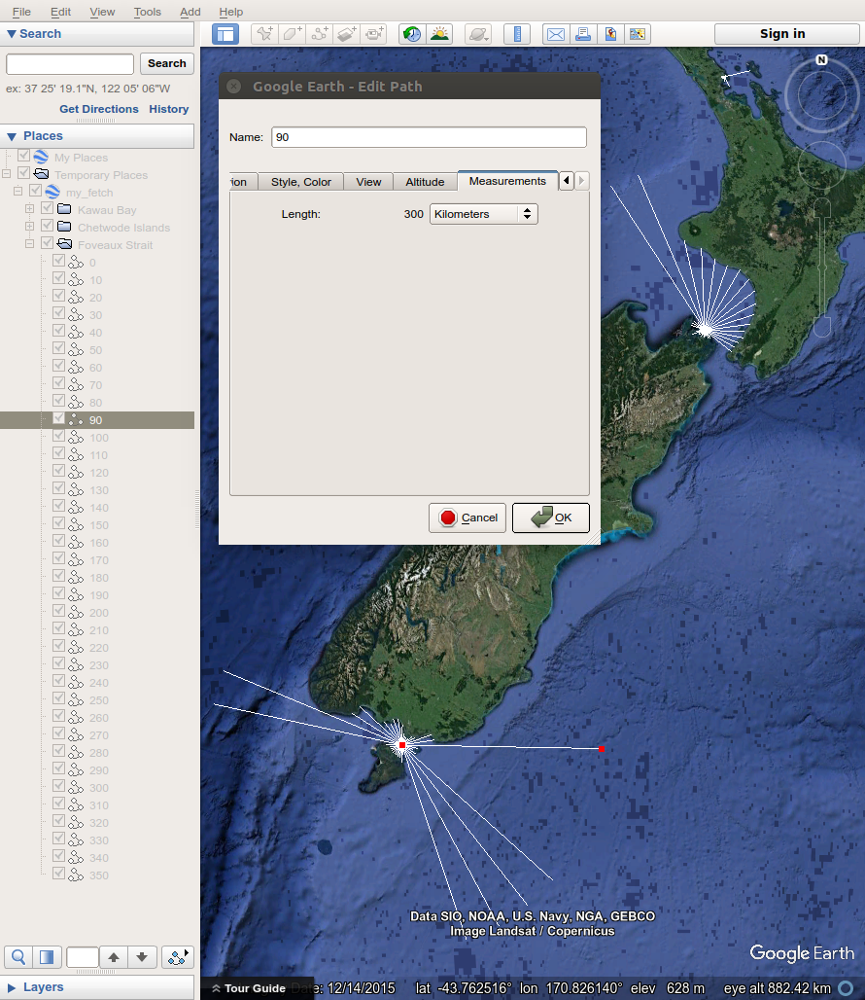

---
output:
  md_document:
    variant: markdown_github
---

<!-- README.md is generated from README.Rmd. Please edit that file -->

```{r, echo = FALSE}
knitr::opts_chunk$set(
  collapse = TRUE,
  comment = "#>",
  fig.path = "README_figures/README-"
)
library(fetchR)
```

[](https://travis-ci.org/blasee/fetchR)

# Wind Fetch

Wind fetch is an important measurement in coastal applications. It provides a measurement for the unobstructed length of water over which wind from a certain direction can blow over. The higher the wind fetch from a certain direction, the more energy is imparted onto the surface of the water resulting in a larger sea state. Therefore, the larger the fetch, the larger the exposure to wind and the more likely the site experiences larger sea states.

# Why **fetchR**?

Averaging the wind fetch for numerous directions at the same location is a reasonable measure of the overall wind exposure. This process of calculating wind fetch can be extremely time-consuming and tedious, particularly if a large number of fetch vectors are required at many locations. The **fetchR** package calculates wind fetch for any marine location on Earth. There are also plot methods to help visualise the wind exposure at the various locations, and methods to output the fetch vectors to a KML file for further investigation.

# Installation

You can install the latest version of **fetchR** from GitHub.

```{r, eval = FALSE}
if (!require(devtools))
  install.packages("devtools")

devtools::install_github("blasee/fetchR", build_vignettes = TRUE)
```

Read the short introductory vignette to get you started.

```{r, eval = FALSE}
library(fetchR)

# Read the short vignette
vignette("introduction-to-fetchR")

# Reproduce a simple example
example(fetch)
```



