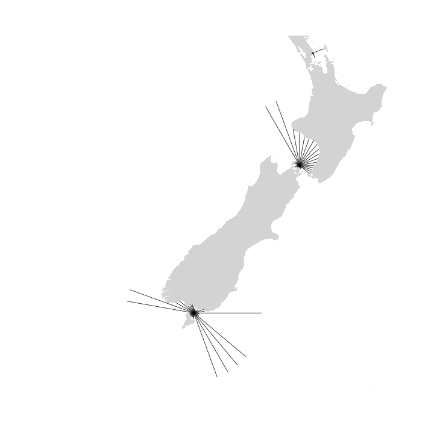
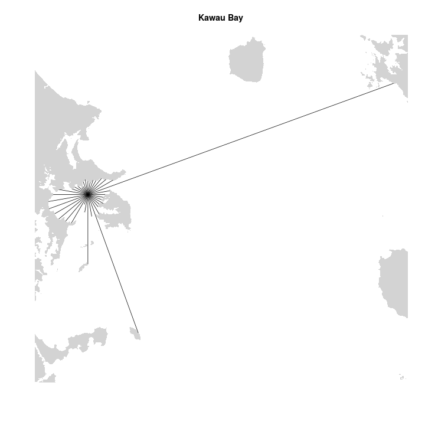
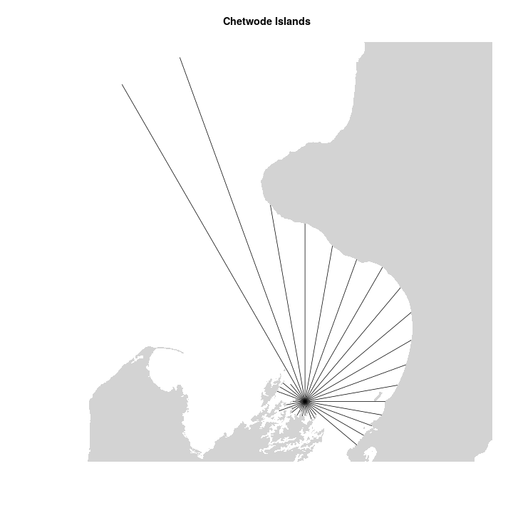
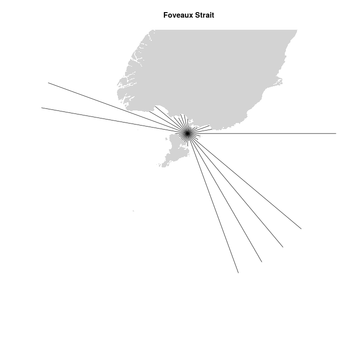

---
output:
  md_document:
    variant: markdown_github
---

<!-- README.md is generated from README.Rmd. Please edit that file -->

```{r, echo = FALSE}
knitr::opts_chunk$set(
  collapse = TRUE,
  comment = "#>",
  fig.path = "README_figures/README-"
)
library(fetchR)
```

[](https://travis-ci.org/blasee/fetchR)

# Wind fetch

Wind fetch is an important measurement in coastal applications. It provides a measurement for the unobstructed length of water over which wind from a certain direction can blow over. The higher the wind fetch from a certain direction, the more energy is imparted onto the surface of the water resulting in a larger sea state. Therefore, the larger the fetch, the larger the exposure to wind and the more likely the site experiences larger sea states.

# Why **fetchR**?

Averaging the wind fetch for numerous directions at the same location is a reasonable measure of the overall wind exposure. This process of calculating wind fetch can be extremely time-consuming and tedious, particularly if a large number of fetch vectors are required at many locations. The **fetchR** package calculates wind fetch for any marine location on Earth. There are also plot methods to help visualise the wind exposure at the various locations, and methods to output the fetch vectors to a KML file for further investigation.

# Installation

You can install the latest version of **fetchR** from GitHub.

```{r, eval = FALSE}
if (!require(devtools))
  install.packages("devtools")

devtools::install_github("blasee/fetchR", build_vignettes = TRUE)

# Load the fetchR package
library(fetchR)
```

# Calculating wind fetch with **fetchR**

If you already have a `SpatialPolygons` object representing the coastline and 
surrounding islands, and a `SpatialPoints` object representing the locations, 
then calculating wind fetch with **fetchR** is easy. You can just pass these
two arguments into the `fetch` function.

```{r, eval = FALSE}
# Calculate wind fetch by passing in the projected SpatialPolygons object (nz_poly_proj)
# and the projected SpatialPoints object (fetch_locs_proj) to the fetch function.
my_fetch_proj = fetch(nz_poly_proj, fetch_locs_proj)

my_fetch_proj
```

```{r, echo = FALSE}
load("vignettes/data/my_fetch.RData")
my_fetch_proj
```

The `my_fetch_proj` provides a summary of the fetch for all the four quadrants,
along with an overall average of the fetch length at all the sites.

# Visualise the fetch vectors

```{r, eval = FALSE}
# Plot the fetch vectors, along with the coastline and surrounding islands
plot(my_fetch_proj, nz_poly_proj)
```









# Export to a KML file

```{r, eval = FALSE}
# Export the fetch vectors to a KML file for further investigation
kml(my_fetch_proj)
```

Note that the distances calculated in Google Earth are (almost) the
same as the distances calculated with **fetchR**. This can be seen in the KML
output as the fetch vector at 90 degrees for the Foveaux Strait site is 300km
(the maximum distance by default) in both **fetchR** and Google Earth, although
these algorithms differ.


# Get started with **fetchR**

Read the short introductory vignette to get you started with **fetchR**, and
have a look at the simple, reproducible example in the `fetch` function.

```{r, eval = FALSE}
# Read the short vignette
vignette("introduction-to-fetchR")

# Reproduce a simple example
example(fetch)
```

