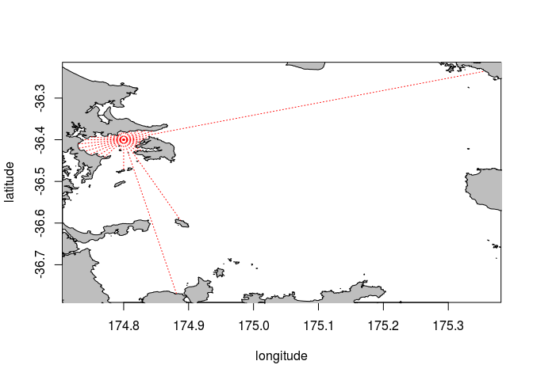
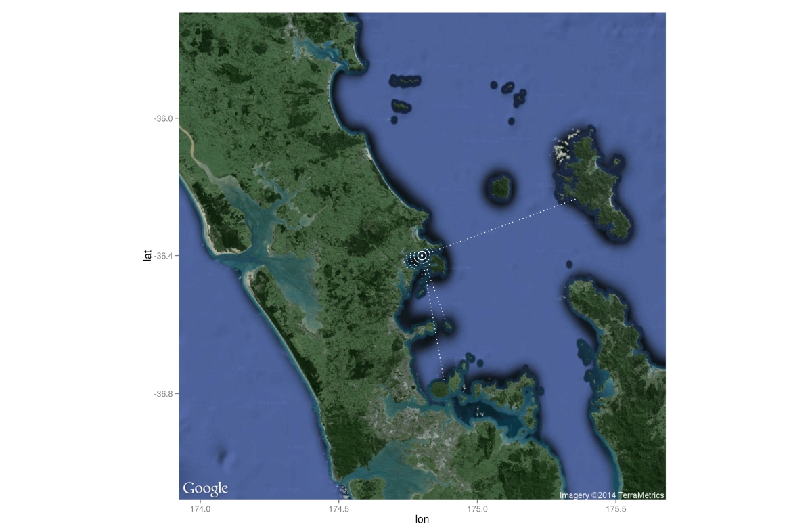
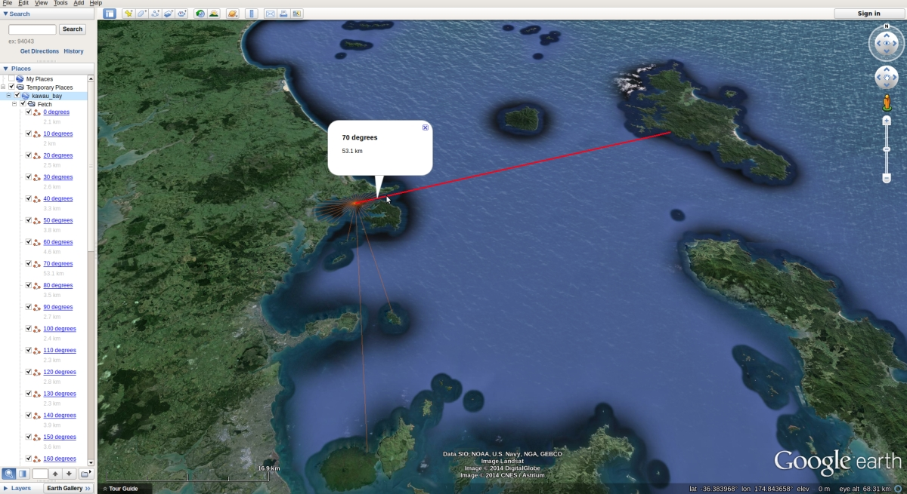

# Calculate average fetch for any coastal area around New Zealand

[](https://travis-ci.org/blasee/fetchR)

This package was designed to provide an objective measurement of fetch for any
coastal location around New Zealand. Calculating fetch by hand is inaccurate,
time-consuming and unreliable. The `fetchR` package provides a single function
to calculate the average fetch, all that is required is the longitude and 
latitude of the location in decimal degrees.

# Installation in R

The installation of `fetchR` requires the `rgeos` package successfully installed.


```r
install.packages("devtools")
library(devtools)
install_github(username = "blasee", repo = "fetchR")
```

# Calculate average fetch

To calculate the average fetch for the marine site at latitude = -36.4 and 
longitude = 174.8 (to the nearest 100m):


```r
library(fetchR)
kawau_bay = fetch(174.8, -36.4)
```

```
## checking coordinate is not on land
## calculating fetch
## 35 more directions to calculate
## 34 more directions to calculate
## 33 more directions to calculate
## 31 more directions to calculate
## 29 more directions to calculate
## 27 more directions to calculate
## 24 more directions to calculate
## 23 more directions to calculate
## 21 more directions to calculate
## 19 more directions to calculate
## 18 more directions to calculate
## 17 more directions to calculate
## 16 more directions to calculate
## 15 more directions to calculate
## 14 more directions to calculate
## 13 more directions to calculate
## 12 more directions to calculate
## 11 more directions to calculate
## 10 more directions to calculate
## 9 more directions to calculate
## 8 more directions to calculate
## 6 more directions to calculate
## 5 more directions to calculate
## 4 more directions to calculate
## 3 more directions to calculate
## 2 more directions to calculate
## 1 more directions to calculate
```

```r
# Contains the distances for each direction
head(kawau_bay)
```

```
##   longitude latitude direction distance
## 1     174.8   -36.38         0      2.1
## 2     174.8   -36.38        10      2.0
## 3     174.8   -36.38        20      2.5
## 4     174.8   -36.38        30      2.6
## 5     174.8   -36.38        40      3.3
## 6     174.8   -36.38        50      3.8
```

The summary function gives the location coordinates, average and median fetch
and the most exposed direction(s).

```r
summary(kawau_bay)
```

```
## Latitude: -36.4
## Longitude: 174.8
## Average fetch:	6.531
## Median fetch:	3.05
## Exposed directions:	70
```

# Plotting methods
Plotting the resulting vectors is easy with the default plot method.

```r
plot(kawau_bay, lty = 3, col = "red")
```

```
## initializing plot...
```



This plot can be further enhanced with the use of the `ggmap` package for R.

```r
# install.packages("ggmap")
library(ggmap)

my_map = ggmap(get_map(c(kawau_bay@location_long, kawau_bay@location_lat), 
                         maptype = "satellite", zoom = 9))

my_map + geom_segment(data = NULL, aes(x = kawau_bay@location_long,
                                       xend = kawau_bay$longitude,
                                       y = kawau_bay@location_lat,
                                       yend = kawau_bay$latitude),
                      na.rm = TRUE, colour = "white", linetype = 3)
```


## Output to KML
Many GIS applications involve KML files for collaboration, interaction and 
editing. The vectors in each direction can be exported to KML files via the 
`save_kml` method.

```r
save_kml(kawau_bay, "kawau_bay.kml")
```

