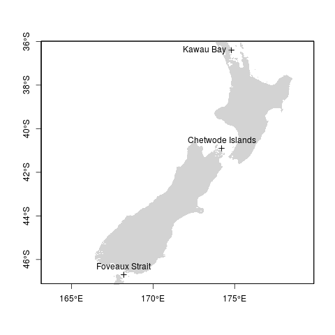
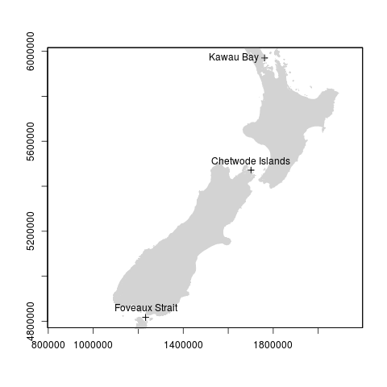
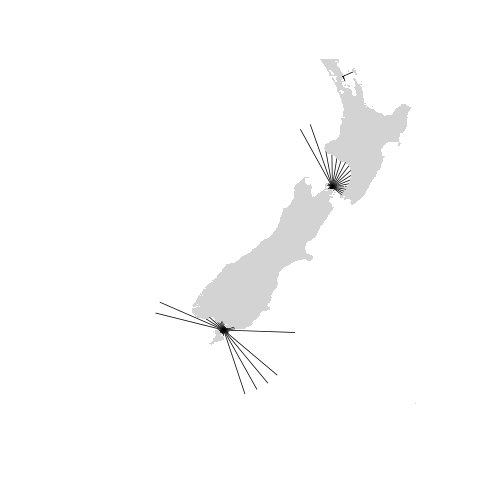
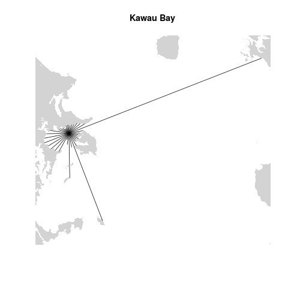
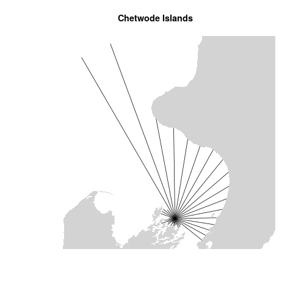
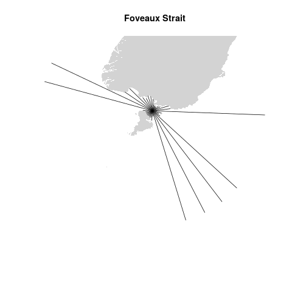
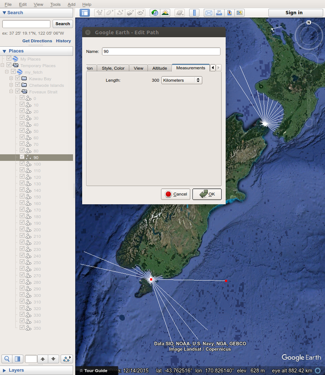

```{r, init, include = FALSE}
knitr::opts_chunk$set(collapse = TRUE, comment = "#>")
load("data/my_fetch.RData")
my_fetch_latlon.df = as(my_fetch_latlon, "data.frame")
```

# Introduction

Wind fetch is an important measurement in coastal applications. It is calculated as the unobstructed length of water over which wind from a certain direction can blow over. The higher the fetch from a certain direction, the more energy is imparted onto the surface of the water resulting in a larger sea state. This has important implications for coastal areas as large waves contribute to coastal erosion and sediment resuspension therefore fetch is commonly used as an indication for the exposure of coastal locations.

Wind fetch is typically calculated many times for vectors pointing in different directions so an average fetch length for a location can be calculated. The average fetch length is a reasonable measure of the overall wind exposure for a particular location. A subset of these vectors may also be chosen to calculate the average northerly fetch component, for example, by averaging the length of all the fetch vectors within the northerly quadrant between 315 and 45 degree angles. This process of calculating fetch vectors for multiple directions and averaging their lengths can be extremely time-consuming and tedious, particularly if a large number of fetch vectors are required at many locations.

The **fetchR** package calculates and summarises fetch vector lengths to assess the wind exposure of any marine location on Earth. It also provides methods to assist in the visualisation of the wind exposure, and allows the user to export the fetch vectors and lengths as a KML (or CSV) file.

This short vignette provides an introduction to the **fetchR** package by using an example for calculating the wind fetch at 3 separate coastal locations around New Zealand. All the required steps are documented and all the code is available to reproduce this example and to build upon these fundamentals to suit individual requirements.

## Shiny application

To use the **fetchR** package without even needing **R**, check out the 
[online version](https://blasee.shinyapps.io/fetchR_shiny/). For help on using 
the application refer to the
[README](https://github.com/blasee/fetchR/blob/master/README_shiny.md#calculate-wind-fetch-using-the-shiny-application).

# Typical usage

The remaining sections are set out in the order of the intended, typical usage of **fetchR**:

1. Create the coastline geography layer

    This layer contains all the information associated with any coastlines, islands and other obstructions that limit wind fetch.

2. Define the marine locations

    This layer contains one or more marine locations at which wind fetch will be calculated.
    
3. Calculate wind fetch

    The `fetch` function is responsible for calculating the wind fetch and is the only function exported by the **fetchR** package.
    
4. Plot the fetch vectors

5. Export to a KML file

```{r}
# Load the fetchR package
library(fetchR)
```

# Create the coastline geography layer

The coastline geography layer contains all the relevant information about coastlines, islands, exposed reefs and rocks, and any other barriers to wind within the area of interest. Each of these obstructions must be polygons and therefore represented in **R** as a `SpatialPolygons` object. Typically, all of the data relevant for this layer will be contained within an ESRI shapefile, therefore the following section deals with importing a shapefile into **R**.

###### Note

For a less-precise alternative to importing a high-resolution shapefile, the reader is referred to the reproducible example in the `fetch` documentation that uses map data from the **maps** package instead. This can be run interactively in **R** by typing `example(fetch)`.

## From an ESRI shapefile to a `SpatialPolyons` object

To calculate the wind fetch in **fetchR** it is best to use high-resolution polygons to ensure a high level of accuracy. For this example, the high-resolution shapefile of New Zealand's coastline and surrounding islands was downloaded from the [Land Information New Zealand (LINZ) Data Service](https://data.linz.govt.nz/layer/1153-nz-coastlines-and-islands-polygons-topo-150k/)[^1] as a GIS shapefile with the WGS84 (EPSG:4326 Lat/Long) map projection. The contents were unzipped into a folder named 'nz_polygon' in the home directory.

```{r, eval = FALSE}
# Read in the Polygon ESRI shapefile
nz_poly_latlon = rgdal::readOGR("nz_polygon")

# Ensure it is a SpatialPolygons object
is(nz_poly_latlon, "SpatialPolygons")
```

```
#> TRUE
```

##### Note
The shapefile must be a Polygon shapefile.

# Define the marine locations

The marine locations are the locations at which the wind fetch is to be calculated. There are three requirements for specifying the marine locations. They need to be:

1. within the boundaries of the coastal geography layer.

2. located in the water.

3. `SpatialPoints` objects in **R**.

The `SpatialPoints` object can be created from a data frame in **R** that contains the relevant information.

```{r}
# Create a data frame with the latitudes, longitudes and names of the
# locations
fetch.df = data.frame(
  lon = c(174.8, 174.2, 168.2),
  lat = c(-36.4, -40.9, -46.7),
  name = c("Kawau Bay", "Chetwode Islands", "Foveaux Strait"))

fetch.df
```

```{r, eval = FALSE}
# Create a SpatialPoints object for the fetch locations
fetch_locs = SpatialPoints(fetch.df[, 1:2], 
                               CRS(proj4string(nz_poly_latlon)))
```



# Map projections

The choice of map projection plays a vital role in calculating fetch. The Earth is not flat, and as a result a straight line between two points on a globe does not (necessarily) trace the same path of a straight line between the same two points on a map. This has important implications for calculating wind fetch in 2 dimensions, and as a result **fetchR** requires that at least one of the above layers are projected. This ensures that a single fetch vector on the projected map represents wind *continuously* travelling from the same direction on Earth.

The 
[New Zealand Transverse Mercator 2000 (NZTM2000)](http://spatialreference.org/ref/epsg/nzgd2000-new-zealand-transverse-mercator-2000/) 
is based on the NZGD2000 datum using the GRS80 reference ellipsoid. It is an internationally recognised projection with little distortion at its east--west extents. This map projection provides a high level of accuracy for representing the entire mainland and surrounding coastal islands, which also encompasses the area spanned by the three marine locations. For this reason, the NZTM2000 map projection is a reasonable map projection for calculating fetch around coastal New Zealand.

```{r, eval = FALSE}
# Transform the coastline geography and marine locations layers onto the
# NZTM2000 coordinate reference system. Note the EPSG for the NZTM2000 
# projection is 2193.
nz_poly_proj = spTransform(nz_poly_latlon, CRS("+init=epsg:2193"))

fetch_locs_proj = spTransform(fetch_locs, CRS("+init=epsg:2193"))
```



# Calculate wind fetch

The **fetchR** package only exports one function; `fetch`. The `fetch` function has two mandatory arguments; the coastline geography layer (`polygon_layer`), and the marine locations layer (`site_layer`). The default behaviour is to calculate 9 equiangular fetch vectors per quadrant (i.e. one fetch vector per 10 degrees), with a maximum distance of 300 km.

```{r, eval = FALSE}
# Calculate wind fetch at Kawau Bay, Chetwode Islands and Foveaux Strait
my_fetch_proj = fetch(polygon_layer = nz_poly_proj,
                      site_layer = fetch_locs_proj,
                      max_dist = 300,
                      n_directions = 9,
                      site_names = fetch.df$name)

my_fetch_proj
```

```{r, echo = FALSE}
my_fetch_proj
```

The resultant summary contains information on the average fetch length for the northerly, easterly, southerly and westerly quadrants, along with an overall average fetch length for each site. All of the raw data is also contained within the `my_fetch_proj` object that can be coerced to a data frame.

```{r, eval = FALSE}
# Transform back to the original lat/lon coordinates
my_fetch_latlon = spTransform(my_fetch_proj, CRS(proj4string(nz_poly_latlon)))

# Create a data frame containing the raw data
my_fetch_latlon.df = as(my_fetch_latlon, "data.frame")

# Show the first 6 rows from the data frame
head(my_fetch_latlon.df)
```

```{r, echo = FALSE}
head(my_fetch_latlon.df)
```

# Plot the fetch vectors

The `plot` method can be used to visualise the fetch vectors that went into calculating the fetch lengths.

```{r, eval = FALSE}
# Plot the fetch vectors for all the locations with the coastline geography 
# layer
plot(my_fetch_latlon, nz_poly_latlon)
```



```{r, eval = FALSE}
# Or plot the locations individually
plot(my_fetch_latlon[[1]])
plot(nz_poly_latlon, add = TRUE, col = "lightgrey", border = NA)
```







# Export to a KML file

The fetch vectors can be exported to a KML file easily with the `kml` method. 
Each of the marine locations have a separate folder containing the fetch vectors
with names that match their respective directions (Figure 7).

```{r, eval = FALSE}
# Export the fetch vectors to a KML file. Colour white to increase contrast.
kml(my_fetch_latlon, colour = "white")
```



[^1]: This requires a (free) [registration to the LINZ Data Service](https://data.linz.govt.nz/accounts/register/) and acceptance of the [terms of conditions](https://data.linz.govt.nz/terms-of-use/) and [privacy policy](https://data.linz.govt.nz/privacy-policy/). The data sourced from
Land Information New Zealand has not been adapted and is protected under 
CC-By Land Information New Zealand.
